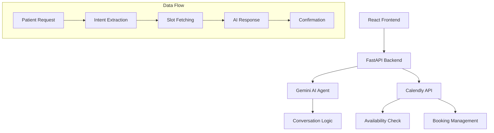

# 🏥 Medical Appointment Scheduling Agent

An intelligent conversational agent that helps patients schedule medical appointments through natural conversation with Calendly integration. Built with FastAPI, Gemini AI, and React.


## ✨ Features

### 🤖 Intelligent Conversation Flow
- **Natural Language Understanding**: Gemini AI-powered conversation
- **Context-Aware**: Maintains conversation context across messages
- **Empathetic Responses**: Professional and caring medical assistant tone
- **Multi-step Scheduling**: Guided appointment booking process

### 📅 Calendly Integration
- **Real-time Availability**: Fetch doctor's schedule dynamically
- **Appointment Types**: Support for 4 appointment types with different durations
- **Smart Suggestions**: AI suggests optimal time slots based on preferences
- **Booking Management**: Create, reschedule, and cancel appointments

### 🎯 Appointment Types
| Type | Duration | Purpose |
|------|----------|---------|
| General Consultation | 30 min | General health concerns |
| Follow-up | 15 min | Routine check-ups |
| Physical Exam | 45 min | Comprehensive exams |
| Specialist Consultation | 60 min | Specialized care |


## 🏗️ Architecture



## 🛠️ Tech Stack

**Backend:**
- **Python 3.10+** with functional programming approach
- **FastAPI** - High-performance web framework
- **Google Gemini AI** - Natural language processing
- **Calendly API** - Appointment scheduling
- **Pydantic** - Data validation
- **httpx** - Async HTTP client

**Frontend:**
- **React 18** - UI library
- **Tailwind CSS** - Styling
- **Axios** - HTTP client
- **date-fns** - Date formatting

## 🚀 Quick Start

### Prerequisites
- Python 3.10 or higher
- Node.js 16+ and npm
- Google Gemini API key
- Calendly account with API access

### Installation
```bash
# Clone the repository
git clone https://github.com/mohdyaserkt/Medical-Appointment-Scheduling-Agent.git
cd Medical-Appointment-Scheduling-Agent

# Backend setup
cd backend
pip install -r requirements.txt

# Frontend setup
cd ../frontend
npm install

# Set up environment variables (see below)
# Run both services
```

## ⚙️ Setup Instructions

### 1. Calendly API Setup

#### Step 1: Create Calendly Account
1. Go to [Calendly.com](https://calendly.com) and sign up
2. Complete your profile setup
3. Create event types matching your appointment types:
   - General Consultation (30 min)
   - Follow-up (15 min)
   - Physical Exam (45 min)
   - Specialist Consultation (60 min)

#### Step 2: Get API Access
1. Navigate to **Integrations** → **API & Webhooks**
2. Click **Create New Token**
3. Copy your API key (save it securely)


### 2. Google Gemini API Setup

#### Step 1: Get API Key
1. Go to [Google AI Studio](https://aistudio.google.com/app/api-keys)
2. Sign in with your Google account
3. Click **Create API Key**
4. Copy the generated key


### 3. Environment Variables

#### Backend Configuration
Create `.env` file in the `backend/` directory:

```env
# Calendly Configuration
CALENDLY_API_KEY=your_calendly_api_key_here
CALENDLY_ORGANIZATION_URI=https://api.calendly.com/organizations/your-org-id
CALENDLY_USER_URI=https://api.calendly.com/users/your-user-id

# Calendly Event Type URIs (from your Calendly dashboard)
CALENDLY_GENERAL_CONSULTATION_URI=https://api.calendly.com/event_types/your-general-consultation-id
CALENDLY_FOLLOWUP_URI=https://api.calendly.com/event_types/your-followup-id
CALENDLY_PHYSICAL_EXAM_URI=https://api.calendly.com/event_types/your-physical-exam-id
CALENDLY_SPECIALIST_URI=https://api.calendly.com/event_types/your-specialist-id

# Gemini AI Configuration
GOOGLE_API_KEY=your_google_gemini_api_key_here


CORS_ORIGINS=http://localhost:5173
```

#### Frontend Configuration
Create `.env` file in the `frontend/` directory:

```env
REACT_APP_API_URL=http://localhost:8000/api/v1
REACT_APP_WEBSOCKET_URL=ws://localhost:8000/ws
REACT_APP_CLINIC_NAME="HealthFirst Medical Center"
```

### 4. Project Setup

#### Backend Setup
```bash
cd backend

# Create virtual environment
python -m venv venv

# Activate virtual environment
# On Windows:
venv\Scripts\activate
# On macOS/Linux:
source venv/bin/activate

# Install dependencies
pip install -r requirements.txt

# Set up environment
cp .env.example .env
# Edit .env with your actual API keys

# Run database migrations (when implemented)
# alembic upgrade head

# Start the backend server
uvicorn main:app --reload --host 0.0.0.0 --port 8000
```

#### Frontend Setup
```bash
cd frontend

# Install dependencies
npm install

# Set up environment
cp .env.example .env
# Edit .env with your backend URL

# Start the development server
npm start
```


